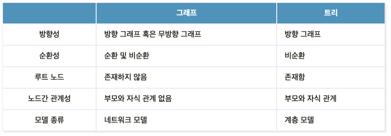

### 개념
$$G = (V, E)$$

* 연결되어 있는 원소를 Vertex 와 Edge 의 집합으로 표현되는 데이터
* 인접 행렬, 인접 리스트, 간선리스트 방식으로 값을 저장할 수 있음
  이 중 주로 사용하는 것은 인접 행렬, 인접 리스트 방식
   [그래프 저장 방법](https://velog.io/@eunchae2000/%EC%9E%90%EB%A3%8C%EA%B5%AC%EC%A1%B0-%EA%B7%B8%EB%9E%98%ED%94%84%EB%A5%BC-%EC%A0%80%EC%9E%A5%ED%95%98%EB%8A%94-%EB%B0%A9%EB%B2%95-3%EA%B0%80%EC%A7%80-%EC%9D%B8%EC%A0%91-%ED%96%89%EB%A0%AC-%EC%9D%B8%EC%A0%91-%EB%A6%AC%EC%8A%A4%ED%8A%B8-%EA%B0%84%EC%84%A0-%EB%A6%AC%EC%8A%A4%ED%8A%B8-with-Python)
* 트리는 그래프의 일종인데, 여러 노드가 한 노드를 가리킬 수 없는 구조 

---
### 구현

* 두 가지 방식의 공간 복잡도와 시간 복잡도의 차이가 있음

**인접 행렬**
* 메모리 : O(V * V)
* 조회 시간 복잡도 : O(1)

**인접 리스트**
* 메모리 : O(E)
* 조회 시간 복잡도 : O(V)

---
### 유형

* 방향 그래프
* 무방향 그래프
* 가중치가 포함된 그래프
* 이분그래프
* 그래프 사이클 유무 판별
* Disjoint Set
* Spanning Tree
